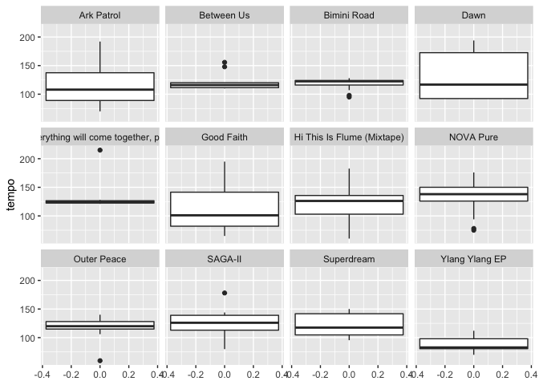
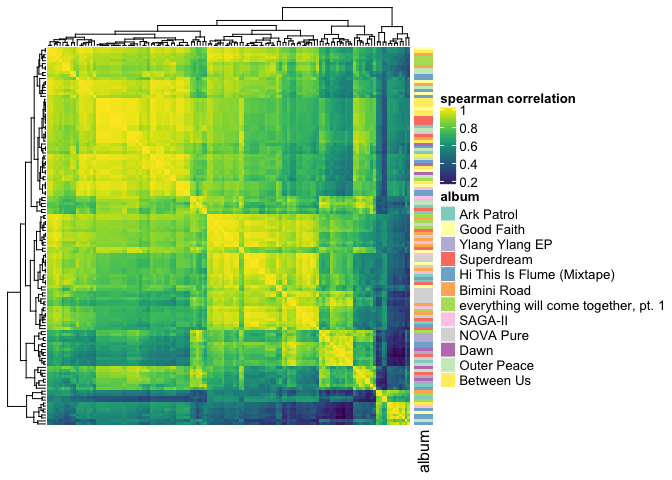

The Boys Rank Electronic Music - 2019
================
Vinay Swamy

My take on our ranking of electronic music albums of 2019. To make this
analysis a little easier, I’m only going to do the top 5 albums from
each person.

Spotify has an api to access metadata for a given track. I used the
python library spotipy to pull the following informatin for each song in
each
album

| track                           |   danceability |    energy |   key |   loudness |    speechiness |    acousticness | instrumentalness | liveness | valence |   tempo | type            | duration\_ms | time\_signature | genre      |
| :------------------------------ | -------------: | --------: | ----: | ---------: | -------------: | --------------: | ---------------: | -------: | ------: | ------: | :-------------- | -----------: | --------------: | :--------- |
| Star Sale                       |          0.689 |     0.464 |    11 |   \-11.610 |         0.0389 |         0.02900 |          0.65800 |    0.143 |   0.467 | 116.996 | audio\_features |       229625 |               4 | vapor soul |
| Fiend                           |          0.547 |     0.396 |     5 |   \-12.082 |         0.0239 |         0.20300 |          0.07490 |    0.646 |   0.155 |  86.006 | audio\_features |       219953 |               4 | vapor soul |
| Entropy                         |          0.523 |     0.330 |     8 |   \-10.417 |         0.0575 |         0.73000 |          0.08330 |    0.537 |   0.129 |  69.984 | audio\_features |       371016 |               4 | vapor soul |
| Kraken                          |          0.675 |     0.421 |    11 |   \-12.913 |         0.0579 |         0.06190 |          0.00201 |    0.256 |   0.188 | 149.949 | audio\_features |       261922 |               4 | vapor soul |
| Darling, You Can’t Walk Away    |          0.301 |     0.637 |     8 |    \-7.811 |         0.0389 |         0.00306 |          0.66200 |    0.296 |   0.255 | 192.046 | audio\_features |       193141 |               3 | vapor soul |
| dancebility through valence are | features desig | ned by sp | otify | for a more | quantitative m | easure of music |            ality |          |         |         |                 |              |                 |            |

# Genre

Each artist is assigned a genres, and all music they make falls under
that
genres

| album                                  | artist         | genre                                                                                                                                                                                                                                                                                                                     |
| :------------------------------------- | :------------- | :------------------------------------------------------------------------------------------------------------------------------------------------------------------------------------------------------------------------------------------------------------------------------------------------------------------------ |
| Ark Patrol                             | ark patrol     | vapor soul                                                                                                                                                                                                                                                                                                                |
| Good Faith                             | madeon         | big room                                                                                                                                                                                                                                                                                                                  |
| Ylang Ylang EP                         | fkj            | filter house                                                                                                                                                                                                                                                                                                              |
| Superdream                             | big wild       | edm                                                                                                                                                                                                                                                                                                                       |
| Hi This Is Flume (Mixtape)             | flume          | australian dance                                                                                                                                                                                                                                                                                                          |
| Bimini Road                            | moon boots     | deep house                                                                                                                                                                                                                                                                                                                |
| everything will come together, pt. 1   | justin jay     | bass house                                                                                                                                                                                                                                                                                                                |
| SAGA-II                                | memba          | bass trap                                                                                                                                                                                                                                                                                                                 |
| NOVA Pure                              | rl grime       | bass trap                                                                                                                                                                                                                                                                                                                 |
| Dawn                                   | sg lewis       | alternative r\&b                                                                                                                                                                                                                                                                                                          |
| Outer Peace                            | toro y moi     | alternative dance                                                                                                                                                                                                                                                                                                         |
| Between Us                             | hayden james   | aussietronica                                                                                                                                                                                                                                                                                                             |
| Theres a pretty wide spread of genres, | with only bass | trap being the only repeat genre.I have a suspicion that genres are assigned to an artist and then not changed after. For example, look at Madeon and Big Wild, which respectively are assigned as big room and edm. While the early work of these two artists might fit those labels, their new albums defintely do not. |

# Tempo

Now lets compare the tempos between albums

<!-- -->

Unsurpisingly the two house albums, Bimini road and Everything will come
together, have the least variance in tempo. Good Faith, and Dawn(which i
have not listened to) have the biggest spread in tempo

# Music Features

I was curious to see how well Spotify’s music features capture the
distinctness of each album First, from each album, I calculated the
average correlation between songs using these features

    ##  [1] "danceability"     "energy"           "key"             
    ##  [4] "loudness"         "speechiness"      "acousticness"    
    ##  [7] "instrumentalness" "liveness"         "valence"         
    ## [10] "tempo"

| albums                               | Average Correlation |
| :----------------------------------- | ------------------: |
| Between Us                           |           0.8598909 |
| Ylang Ylang EP                       |           0.8505051 |
| NOVA Pure                            |           0.8414918 |
| Good Faith                           |           0.7950413 |
| Superdream                           |           0.7878788 |
| Outer Peace                          |           0.7846348 |
| Dawn                                 |           0.7783550 |
| SAGA-II                              |           0.7521886 |
| Bimini Road                          |           0.7521017 |
| everything will come together, pt. 1 |           0.7320794 |
| Ark Patrol                           |           0.6937374 |
| Hi This Is Flume (Mixtape)           |           0.6172174 |

So it looks like most albums have a fairly decent within-album
similarity

I wanted to see how all the songs compare to each other, so I calculated
the pairwise similarity between songs, and then clustered them based on
similarity

<!-- -->
